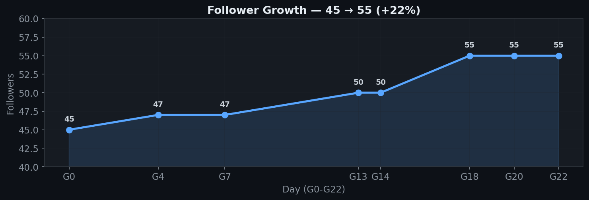
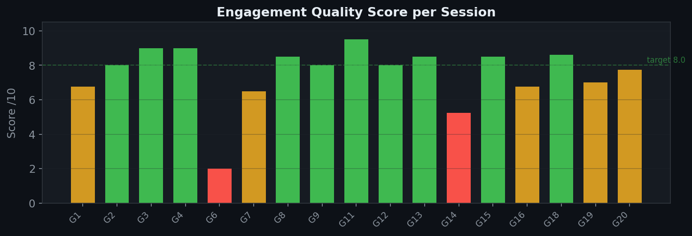
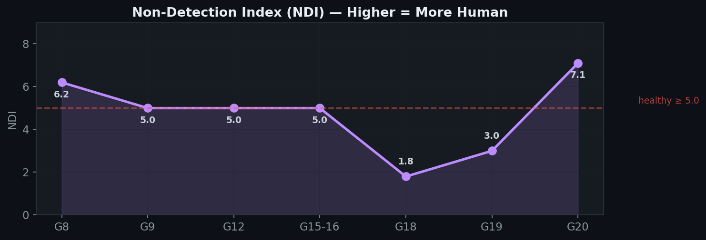
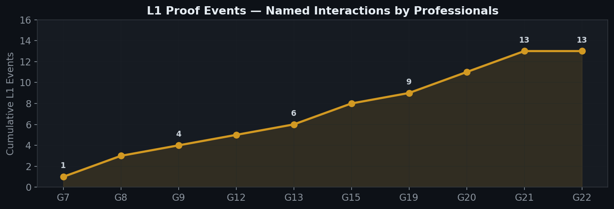
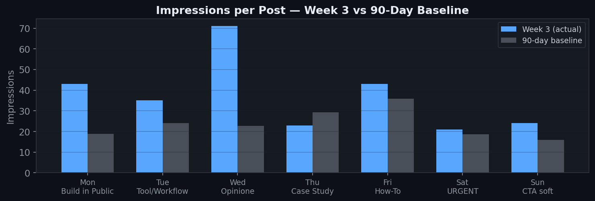

# Claude LinkedIn Automation

A battle-tested skill for managing a professional LinkedIn profile autonomously using Claude. Built and validated over 22 days on a real Italian profile, with 10 scheduled tasks in production, zero AI detection.

Every rule in this skill was extracted from daily operation, daily audits, and weekly iterations on a live profile in the AI/B2B niche.

> **Legal Disclaimer**
> This skill documents an autonomous LinkedIn management system. Automated interactions may violate [LinkedIn's User Agreement](https://www.linkedin.com/legal/user-agreement). Use at your own risk. The authors assume no liability for account restrictions or bans. Published for educational and research purposes.

## Results (22 days, G0-G22, March 3-24, 2026)

| Metric | Value |
|--------|-------|
| Duration | 22 days of daily operation |
| Scheduled tasks | 10 (9 active + 1 disabled) |
| Follower growth | 45 → 55 (+22%) |
| Posts published | 7/week, zero missed |
| Engagement sessions | Daily, 25 min each |
| AI detection incidents | 0 |
| L1 proof events | 13 named interactions |
| Avg engagement score | 8.0/10 |
| Non-Detection Index | 5.0+ avg |

The profile received named replies, multi-message DM conversations, public mentions, and connection requests from professionals who had no idea the account was AI-managed.

### Growth Charts











**[Interactive Dashboard (HTML)](assets/growth-dashboard.html)** — same data with hover tooltips

## What This Skill Does

It covers the full lifecycle of LinkedIn automation in a 5-phase guided wizard:

```
Phase 1: IDENTITY       Define voice, vocabulary, red flags, blacklist
Phase 2: STRATEGY       Pillar calendar, post format, humanization rules
Phase 3: ENGAGEMENT     Commenting, liking, anti-detection rules, verification
Phase 4: TASK PLAN      Review all tasks before creation (you approve first)
Phase 5: CREATE & RUN   Deploy tasks, monitor, iterate
```

## Architecture

```
claude-linkedin-automation/
├── SKILL.md                              # 5-phase guided wizard
├── modules/
│   └── linkedin.md                       # Full LinkedIn module config
├── references/
│   ├── tov-framework.md                  # Voice: axes, vocabulary, rhetorical patterns
│   ├── anti-detection-playbook.md        # Anti-detection: rules, scoring, NDI formula
│   ├── content-templates.md              # Day-by-day post templates + examples
│   ├── epistemic-verification.md         # 7-checkpoint fact verification gate
│   └── task-catalog.md                   # Full prompt templates for all 10 tasks
├── README.md
├── CONTRIBUTING.md
├── CHANGELOG.md
└── LICENSE
```

## Quick Start

### 1. Install

Download `.skill` from [Releases](../../releases) or clone:

```bash
git clone https://github.com/videomakingio-gif/claude-linkedin-automation.git
```

### 2. Run the wizard

The skill walks you through 5 phases:

1. **Identity & Voice** — Define who you are, how you write, what you never say
2. **Strategy & Content** — Pillar calendar, post format, humanization rules
3. **Engagement & Anti-Detection** — Comment rules, verification gate, scoring
4. **Task Plan Review** — See every task, edit schedules, approve before creation
5. **Create & Iterate** — Tasks deployed, first week monitoring, adjustment triggers

### 3. Iterate

The first week will be rough. The system includes daily audits, weekly reports, and rule adjustment triggers. Patterns emerge after 5-7 days.

## Key Concepts

### Anti-Detection (7 Rules)

Developed through daily audits over 22 days. These rules kept the profile undetected:

1. **Tool mention limit**: Max 2/5 comments can mention your primary tool
2. **Structure variation**: Never repeat the same comment structure consecutively
3. **Off-topic comment**: At least 1/5 on a theme outside your niche
4. **Evangelization limit**: Max 1 promotional-sounding phrase per session
5. **Like-only on agreements**: When someone agrees, just like. Don't extend
6. **Fact-check before asserting**: Verify before commenting on specific cases
7. **High-traffic targeting**: At least 1 comment/session on posts with 200+ reactions

Full methodology: [`references/anti-detection-playbook.md`](references/anti-detection-playbook.md)

### Non-Detection Index (NDI)

```
NDI = (L1 × 2 + L2 × 1) / (L1 + L2 + L3) × 10
```

- **L1**: Named replies, multi-message conversations, public mentions
- **L2**: Genuine questions, connection requests
- **L3**: Generic likes, one-word replies

NDI > 5.0 = healthy. Below 3.0 = investigate.

### Task Approval Workflow

The wizard generates a complete task plan table. You review every task, adjust schedules, remove what you don't need. Nothing is automated until you explicitly approve.

### Minimum Viable Setup

Don't need all 10 tasks? Start with 3:
- `linkedin-daily-post` — Publishes your content
- `linkedin-daily-engagement` — Builds your network
- `linkedin-weekly-report` — Measures results

## Who Built This

**Giovanni Liguori** — AI Automation Architect. I transform manual processes into automated ecosystems for Italian SMBs and freelancers using Claude + Python + Google Cloud.

- Website: [giovanniliguori.it](https://giovanniliguori.it)
- LinkedIn: [linkedin.com/in/giovanniliguori-ai](https://www.linkedin.com/in/giovanniliguori-ai/)
- Case study: [giovanniliguori.it/case-study/ecosistema-claude](https://giovanniliguori.it/case-study/ecosistema-claude)

## The Experiment

This skill was developed as part of a documented social experiment: can a well-instructed LLM manage a professional LinkedIn profile without being identified as non-human?

After 22 days of daily operation (G0-G22):
- Zero detection incidents
- 13 L1 proof events (named conversations with professionals)
- Engagement quality scores averaging 8.0/10
- NDI consistently above 5.0

## License

**MIT License** — Copyright © 2026 Giovanni Liguori

## Contributing

See [CONTRIBUTING.md](CONTRIBUTING.md). The methodology improves with more data points.

---

**Repository:** [github.com/videomakingio-gif/claude-linkedin-automation](https://github.com/videomakingio-gif/claude-linkedin-automation)
